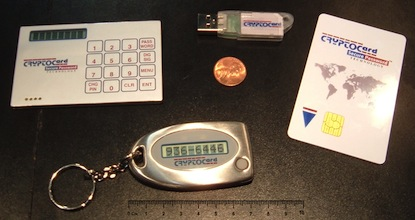

# Authentication

---

# Agenda

* Authentication Factors
* Two-Factor Authentication
* Weak Authentication
* Strong Authentication

---

# Authentication

**Authentication** is the mechanism whereby systems may securely identify their
users.

Authentication systems provide an answers to the questions:

* Who is the user?
* Is the user really who he/she represents himself to be?

Authentication systems depend on some unique bit of information known  only to
the individual being authenticated and the authentication system: a **shared
secret**.

In order to verify the identity of a user, the authenticating system typically
**challenges the user to provide his unique information**.

If the authenticating system can verify that the shared secret was presented
correctly, the user is considered authenticated.

---

# Authentication Factors

The ways in which someone may be authenticated fall into three categories, based
on what are known as the **factors of authentication**: something the user
**knows**, something the user **has**, and something the user **is**.

Each authentication factor covers a range of elements used to authenticate or
verify a person's identity.

The **three** classes are:

* the **ownership/possession factors**: something the user **has**;
* the **knowledge factors**: something the user **knows**;
* the **inherence factors**: something the user **is** or **does**.

---

# Possession Factors

_Something the user has._

### Security Tokens

### Dallas iButton

---

# More Possession Factors

Non exhaustive list:

* Cell Phones
* Connected tokens
* Magnetic stripe cards
* Software tokens
* USB tokens
* Wireless

---

# Knowledge Factors

_Something the user knowns._

Knowledge factors is the most common form of authentication used. In this form
user is required to prove the knowledge of a secret in order to authenticate.

* **Challenge Response**
* **Password**
* **Pass Phrase**
* **Pattern** (on Android devices for instance)
* **P**ersonal **I**dentification **N**umber (PIN)

---

# Inherence Factors

_Something the user is._

* **Fingerprint**
* **Retinal Pattern**
* **DNA sequence**
* **Signature**
* **Face**
* **Voice**

---

# Two-Factor Authentication

---

# Two-Factor Authentication

### Definition

_Multi-factor authentication is an approach to authentication which **requires
the presentation of two or more of the three authentication factors**: a
knowledge factor ("something the user knows"), a possession factor ("something
the user has"), and an inherence factor ("something the user is")._ (Wikipedia)

 

Two-factor authentication is not a new concept, having been used throughout
history. When a bank customer visits a local automated teller machine (ATM), one
authentication factor is the physical ATM card the customer slides into the
machine ("something the user has"). The second factor is the PIN the customer
enters through the keypad ("something the user knows").

---

# Examples

**Amazon Web Services:** AWS Multi-Factor Authentication

**Dropbox:** Two-Factor Verification

**Facebook:** Login approvals

**Google Accounts:** 2-step verification/Google Authenticator

**Microsoft/Hotmail:** Microsoft account Security Code

**Paypal/eBay:** Security Key

---

# Weak Authentication

---

# Weak Authentication

Weak authentication offers authentication without relying on trusted third
parties.

Authentication with passwords is **weak**.

---

# Strong Authentication

---

# Strong Authentication
