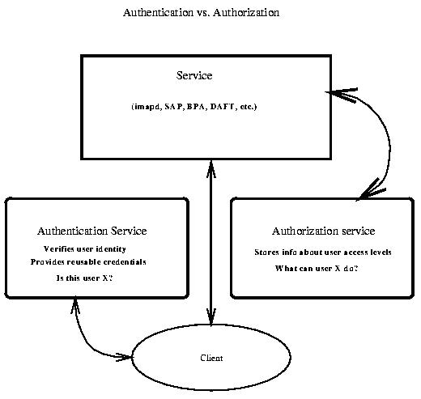

# Authorization

---

# What Is Authorization?

Authorization is the process of **giving someone permission to do or have
something**.

In multi-user computer systems, a system administrator defines for the system
which users are allowed to access to the system and what **privileges** of use.

It is the function of specifying access rights to resources. It is related to
**access control** in information security, and computer security.

Authorization is preceded by **Authentication**.

---

# Authentication vs Authorization

**Authentication** is the mechanism whereby systems may securely identify their
users.

**Authentication systems** provide answers to the following questions:

* **Who is the user?**
* **Is the user really who he/she represents himself to be?**

**Authorization** is the mechanism by which a system determines what **level of
access** a particular authenticated user should have to secured resources
controlled by the system.

**Authorization systems** provide answers to the following questions:

* Is user _X_ authorized to access resource _R_?
* Is user _X_ authorized to perform operation _O_?
* Is user _X_ authorized to perform operation _O_ on resource _R_?

---

# Authentication vs Authorization

<small>Source: [http://people.duke.edu/~rob/kerberos/authvauth.html](http://people.duke.edu/~rob/kerberos/authvauth.html)</small>
