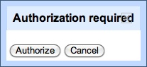
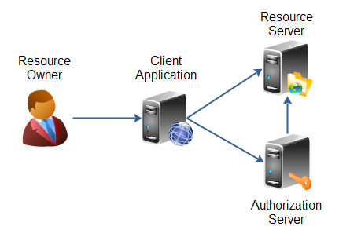
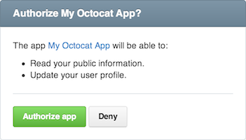
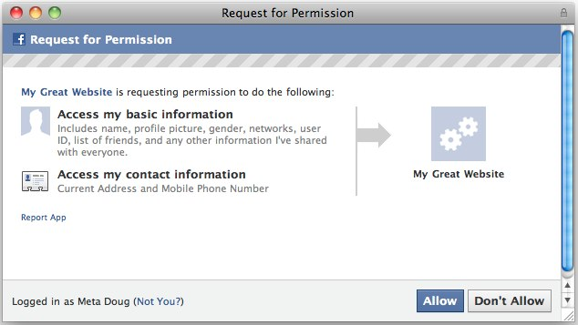

# 

---

# OAuth

OAuth is an **open protocol** to allow **secure authorization** in a simple and
**standard method** from web, mobile and desktop applications.

It is an **authorization framework** that enables a third-party application to
**obtain limited access to an HTTP service**.

### For Consumer Developers

OAuth is a **simple way to publish and interact with protected data**. It is
also a **safer and more secure way** for people to give you access. We've kept
it simple to save you time.

### For Service Provider Developers

If you are **storing protected data** on your users' behalf, they **should not
be spreading their passwords** around the web to get access to it. Use OAuth to
give your users **access to their data while protecting their account
credentials**.

---

# History

The idea came from **Twitter** in November 2006.

A discussion group was created in April 2007, including some Google folks.

The **OAuth Core 1.0 specification** was declared final in December 2007.

Version **1.0 revision A** of the OAuth Core protocol was issued to **address a
session fixation security flaw** in June 2009. In the meantime, Twitter released
a delegated user authentication solution, called _Sign-In With Twitter_.

In April 2010, the OAuth 1.0 Protocol was **published** as an informational [RFC
5849](http://tools.ietf.org/html/rfc5849). It replaces the OAuth Core 1.0
Revision A specification.

Since August 31, 2010, all third party Twitter applications have been required
to use OAuth.

**OAuth 2.0**, the next evolution of the OAuth protocol, which is **not backward
compatible with OAuth 1.0**, was expected by the end of 2010. However, it was
published as [RFC 6749](http://tools.ietf.org/html/rfc6749) in October 2012.

---

# The OAuth 2.0 Controversy

In comparing OAuth 2.0 with 1.0, Eran Hammer (lead author for the OAuth 2.0
project) points out that it has become _"more complex, less interoperable, less
useful, more incomplete, and most importantly, less secure"_.

In July 2012, he resigned his role of lead author, and removed his name from the
specification. Some people did the same, and Dick Hardt took over the editor
role to publish the RFC.

**OAuth 2.0 doesn't support signature, encryption, channel binding, or client
verification**. It **relies completely on SSL** for some degree of
confidentiality and server authentication.

OAuth 2.0 has had numerous security flaws exposed in implementations. The
protocol itself has been described as inherently insecure by security experts
and a primary contributor to the specification stated that implementation
mistakes are almost inevitable.

> A must-read: [OAuth 2.0 and the Road to
Hell](http://hueniverse.com/2012/07/oauth-2-0-and-the-road-to-hell/).

---

# OpenID vs OAuth

OAuth lets you authorize **one web application**, the **consumer**, to access
your data from another web application, the **provider**.

With OAuth, you still need to log into the provider. It could be a standard
username/password login, or it could well be via OpenID.

OpenID gives you **one login** for **multiple web applications**. There is no
suggestion of two web applications sharing your data.

---

# OAuth 1.0a

---

# OAuth 1.0a - Terminology

**User:** a user who has an account of the **Service Provider** and tries to use
the **Consumer**.

**Service Provider:** service that provides an API that uses OAuth
(`api.example.org`).

**Consumer:** an application or web service that wants to use functions of the
**Service Provider** through OAuth authentication (`your.application.org`).

This application must be known by the **Service Provider**, and owns two keys:
a **Consumer Key** and a **Consumer Secret Key**.

**Request Token:** a value that a **Consumer** uses to be authorized by the
**Service Provider**. After completing authorization, it is exchanged for an
**Access Token**.

**Access Token:** a value that contains a key for the **Consumer** to access the
resource of the **Service Provider**.

---

# OAuth 1.0a - Authentication Process

### In A Nutshell

1. You ask for a **Request Token** and specify your **callback**;
2. You direct the user to the **Authorization Screen**;
3. You receive a token at the URL you specified;
4. You ask for an **Access Token**;
5. You make API calls!

 
 
 
_Easy, isn't it?_

---

# OAuth 1.0a - Authentication Process

---

# Getting A Request Token (1/2)

 
 
 
 

    GET https://api.example.org/oauth/v1/request_token?
        oauth_callback=http://your.application.org/oauth&
        oauth_consumer_key=WEhGuJZWUasHg&
        oauth_nonce=zSs4RFI7lakpADpSsv&
        oauth_signature=wz9+ZO5OLUnTors7HlyaKat1Mo0=&
        oauth_signature_method=HMAC-SHA1&
        oauth_timestamp=1330442419&
        oauth_version=1.0

---

# Getting A Request Token (2/2)

`oauth_callback` is the URL of the Consumer that will be redirected after the
Service Provider completes authentication. If the Consumer is not a web
application and has no address to redirect, the lower-case **Out Of Band**
(`oob`) is used as the value.

`oauth_consumer_key` is the Consumer Key provided to you by the application
when you signed up.

`oauth_nonce` is a random string (Number Once).

`oauth_signature` is the signature value for the request.

`oauth_signature_method` is the signature method that you use to sign the
request. This can be `PLAINTEXT`, `HMAC-SHA1` or `RSA-SHA1`.

`oauth_timestamp` is the current timestamp of the request.

`oauth_version` is always `1.0`.

---

# Generating `oauth_signature` (1/2)

### 1. Collect all request parameters

All parameters related to OAuth which start with `oauth_` except for
`oauth_signature` should be collected.

If parameters are used in the `POST` body, they also should be collected.

### 2. Normalize the parameters

Sort all parameters in **alphabetical order** and **apply URL encoding** (RFC
3986) to each key and value.

List the results of URL encoding as `<key>=<value>` format and insert `&`
between each pair.

Apply URL encoding to the entire result again.

---

# Generating `oauth_signature` (2/2)

### 3. Create a Signature Base String

Combine the HTTP method name (GET or POST), the HTTP URL address called by the
Consumer (except for parameters), and the normalized parameter by using `&`. The
combination becomes:

    [GET|POST] + & + [URL string except for parameters] +
        & + [Normalized Parameter]"

### 4. Generating a Key

**Encrypt the string** generated at stage 3 **using the Consumer Secret Key**.

This Consumer Secret Key is obtained when the Consumer has registered in Service
Provider. Using the encryption method, such as `HMAC-SHA1`, generates the final
`oauth_signature`.

---

# Request Token Response

 
 

    oauth_token=z4ezdgj&
    oauth_token_secret=47ba47e0048b7f2105db67df18ffd24bd072688a&
    oauth_expires_in=3600&
    oauth_callback_confirmed=true

 
 
 

The `oauth_token` value is now your **Request Token**.

The `oauth_token_secret` will be used for signing your request for getting an
**Access Token**.

The `oauth_callback_confirmed` value just gives you confirmation that the
`oauth_callback` parameter you provided has been recognized.

---

# The Authorization Step

Now that you have a **Request Token**, you can build the **URL to authorize the
user**:

    https://api.example.org/oauth/v1/authorize?oauth_token=z4ezdgj

It is your job to send the user to this page. It asks the user whether he wants
to authorize your application to access his private data:

When the user authorizes your application, he will either be **sent back** to the
`oauth_callback` specified in the previous step, or **presented with a PIN
code** (Out Of Band authentication).

At this time, the Service Provider passes new `oauth_token` and `oauth_verifier`
to the Consumer. These values are used to request the **Access Token**.

---

# Requesting An Access Token

    GET https://api.example.org/oauth/v1/access_token?
        oauth_consumer_key=WEhGuJZWUasHg&
        oauth_nonce=8B9SpFé&
        oauth_signature=5f78507cf0acc38890cf5aa69721&
        oauth_signature_method=HMAC-SHA1&
        oauth_timestamp=1440442419&
        oauth_token=z4ezdgj&
        oauth_version=1.0&
        oauth_verifier=svmhhd

`oauth_signature` is now signed with the signing key obtained by concatenating
the Consumer Secret Key and `oauth_token_secret` value separated by an `&`
character:

    url_escape(consumer_secret_key)&url_escape(oauth_token_secret)

Generating the `oauth_signature` value follows the same steps described before,
**just the signing key is different**.

The `oauth_verifier` value has been passed through `oauth_callback` when
requesting the **Request Token**.

---

# Access Token Response

 
 

    oauth_token=A%3DqVDHXBE8bRwPoXV9eq4vAtNX_8KVca9&
    oauth_token_secret=c5a9684d3a3aa22aa051308987219efb8d6982fc&
    oauth_expires_in=3600

 
 
 

The `oauth_token` value is now your **Access Token**.

The `oauth_token_secret` will be used for **signing all requests on behalf of
the user**.

---

# 

---

<h1 style="color: red">Not Yet!</h1>

---

# Using An Access Token

Create an HTTP `Authorization` header with all parameters + the
`oauth_signature` generated as usual:

    GET http://api.example.org/users/me
    Authorization: OAuth
        realm="example.org",
        oauth_consumer_key="WEhGuJZWUasHg",
        oauth_nonce="248292331",
        oauth_signature_method="HMAC-SHA1",
        oauth_timestamp="1559450170",
        oauth_token="A%3DqVDHXBE8bRwPoXV9eq4vAtNX_8KVca9",
        oauth_version="1.0",
        oauth_signature="O2AQipLITO0aYHKZc9266RzC94%3D"

 

You will either get the result you expected or a `401`.

---

# 

---

# xAuth

---

# xAuth

**xAuth is still OAuth**.

xAuth provides **a way** for desktop and mobile applications **to exchange a
username and password for an OAuth access token**. Once the Access Token is
retrieved, xAuth-enabled developers should dispose of the login and password
corresponding to the user.

xAuth access should be **restricted to approved applications**.

### In A Nutshell

It is all about **requesting an Access Token directly, without using a Request
Token**. You have to submit `x_auth_*` parameters in addition to the
conventional `oauth_*` parameters:

* `x_auth_username` the login credential of the user the client is obtaining a token
on behalf of;
* `x_auth_password` the password credential of the user the client is obtaining a
token on behalf of.

---

# OAuth 2.0

---

# Roles

OAuth 2.0 defines the following **roles** of users and applications:

* **Resource Owner**: the user;
* **Resource Server**: the API;
* **Client Application**: the third-party application;
* **Authorization Server**: often the same as the API server;

---

# Prerequisites

Before you can begin the OAuth process, you must first **register a new
application**. You usually register **basic information** such as application
name, website, a logo, etc. In addition, you must register a **redirect URI**
to be used for redirecting users to for web server, browser-based, or mobile
applications.

### Redirect URIs

The authorization server will only redirect users to a registered URI, which
helps prevent some attacks. Any HTTP redirect URIs must be protected with **TLS
security**, so the service will only redirect to URIs beginning with `https://`.
This **prevents tokens from being intercepted** during the authorization process.

### Client ID and Secret

After registering your app, you will receive a **client ID** and a **client
secret**. The client ID is considered public information, and is used to build
login URLs, or included in JavaScript source code on a page. **The client secret
must be kept confidential**. If a deployed application **cannot keep the secret
confidential**, such as JavaScript or native apps, then the **secret is not
used**.

---

# Authorization

The first step of OAuth 2 is to get authorization from the user. For
browser-based or mobile apps, this is usually accomplished by displaying an
interface provided by the service to the user.

The authorization grant is given to a client application by the resource owner,
in cooperation with the authorization server associated with the resource
server.

The OAuth 2.0 specification lists **different types of authorization grants**.
Each type has different security characteristics. The most used **authorization
Grant Types** are:

* Authorization Code
* Implicit
* Password
* Client Credentials

---

# Authorization Code (1/3)

In your application, the user will perform the following request, by clicking on
a button to connect his GitHub account for instance:

    GET https://github.com/login/oauth/authorize?
        response_type=code&
        client_id=YOUR_CLIENT_ID&
        redirect_uri=https://example.com/auth&
        scopes=repo

User visits the **Authorization Page**:

---

# Scopes

**Scopes** let you specify exactly what type of access you need.

Scopes limit access for OAuth tokens. They do not grant any additional permission
beyond that which the user already has.

The OAuth 2.0 specification **does not define any value**, it is left up to the
implementor.

Scopes should be expressed as a **list of space-delimited strings**:

    scopes=s1 s2 s3

In practice, many people use comma-separators instead:

    scopes=s1,s2,s3

---

# Example: Facebook Permissions

 
 

---

# Authorization Code (2/3)

On success, user is **redirected back to your site with auth code**:

    https://example.com/auth?code=AUTH_CODE_HERE

On error, user is redirected back to your site with error code:

    https://example.com/auth?error=access_denied

---

# Authorization Code (3/3)

Server exchanges auth code for an **Access Token**:

    POST https://github.com/login/oauth/access_token

POST body:

    grant_type=authorization_code&
    code=CODE_FROM_QUERY_STRING&
    redirect_uri=REDIRECT_URI&
    client_id=YOUR_CLIENT_ID&
    client_secret=YOUR_CLIENT_SECRET

Response:

    {
        "access_token":"e72e16c7e42f292c6912e7710c838347ae178b4a",
        "token_type":"bearer"
    }

Or if there wars an error:

    { "error": "invalid_request" }

---

# Example: Facebook's OAuth Flow

---

# Potential Security Issues (1/2)

### Client account hijacking by connecting attacker's provider account (CSRF attack)

In step _2/3_, provider returns `code` by redirecting the user-agent to:
`https://example.com/auth?code=AUTH_CODE_HERE`.

In step _3/3_, the client must send `code` along with client credentials and
`redirect_uri` to obtain `access_token`.

If the client implementation doesn't use `state` parameter to **mitigate CSRF**,
we can easily connect our provider account to the victim's client account.

---

# Potential Security Issues (1/2)

### Client account hijacking by connecting attacker's provider account (CSRF attack)

#### Remediation

Before sending user to the provider generate a random nonce and save it in
cookies or session. When user is back make sure `state` you received is equal
one from cookies.

> [The Most Common OAuth2
> Vulnerability](http://homakov.blogspot.com/2012/07/saferweb-most-common-oauth2.html)

---

# Potential Security Issues (2/2)

### Account hijacking by leaking authorization code

OAuth documentation makes it clear that providers must check the first
`redirect_uri` is equal `redirect_uri` the client uses to obtain an
`access_token`.

Find a leaking page on the client's domain, insert cross domain image or a link
to your website, then use this page as `redirect_uri`. When your victim will
load crafted URL it will send him to `leaking_page?code=CODE` and victim's
user-agent will expose the code in the `Referrer` header.

#### Remediation

Flexible `redirect_uri` is a bad practice. But if you need it, store
`redirect_uri` for every code you issue and verify it on `access_token`
creation.

> [How I hacked Github
again.](http://homakov.blogspot.fr/2014/02/how-i-hacked-github-again.html)

> More OAuth issues in this [OAuth Security
> Cheatsheet](http://www.oauthsecurity.com/).

---

# Implicit Grant (1/2)

In your application, the user will perform the following request, by clicking on
a button to connect his GitHub account for instance:

    GET https://github.com/login/oauth/authorize?
        response_type=token&
        client_id=YOUR_CLIENT_ID&
        redirect_uri=https://example.com/auth&
        scopes=repo

Look at the `response_type`, it is **token** now.

User visits the **Authorization Page**:

---

# Implicit Grant (2/2)

On success, user is redirected back to your site with the access token in the
**fragment**:

    https://example.com/auth#token=ACCESS_TOKEN

Token is only available to the browser since it is in the fragment.

On error, user is redirected back to your site with error code:

    https://example.com/auth#error=access_denied

### Usage

It is useful for **Browser-Based** applications. No server side code needed, the
client secret is not used, and browser makes API requests directly.

---

# Password Grant

Password grant is only appropriate for **trusted clients**, most likely
first-party applications only. It should be used for **your** services only.

    POST https://github.com/oauth/token

POST body:

        grant_type=password&
        username=USERNAME&
        password=PASSWORD&
        client_id=YOUR_CLIENT_SECRET&
        client_secret=YOUR_CLIENT_SECRET

Response:

    {
        "access_token": "e72e16c7e42f292c6912e7710c838347ae178b4a",
        "token_type": "bearer",
        "expires_in": 3600,
        "refresh_token": "el2132eEdzFEfrfdc"
    }

---

# Client Credentials Grant

    POST https://github.com/oauth/token

POST body:

    grant_type=client_credentials&
    client_id=YOUR_CLIENT_ID&
    client_secret=YOUR_CLIENT_SECRET

Response:

    {
        "access_token": "e72e16c7e42f292c6912e7710c838347ae178b4a",
        "token_type": "bearer",
        "expires_in": 3600,
        "refresh_token": "el2132eEdzFEfrfdc"
    }

### Usage

Application access.

---

# So You Have An Access Token, Now What?

---

# Using The Access Token

The access token allows you to make requests to the API on a behalf of a user:

    GET https://api.github.com/users?access_token=...

The access token can be in the query string as well as in an HTTP header:

    GET https://api.github.com/users
    Authorization: Bearer ...

---

# Refresh Token

It is all about getting a new **Access Token** using a **Refresh Token**.

    POST https://github.com/oauth/token

POST body:

    grant_type=refresh_token&
    refresh_token=el2132eEdzFEfrfdc&
    client_id=YOUR_CLIENT_ID&
    client_secret=YOUR_CLIENT_SECRET

Response:

    {
        "access_token": "ERfegrfEZGrbosfef2E3Rfezfoefezf",
        "expires_in": 3600,
        "refresh_token": "el2132eEdzFEfrfdc"
    }

---

# Differences From OAuth 1.0

### Security

OAuth 2.0 **replaces signatures with requiring HTTPS for all communications**
between browsers, clients and the API. It is easier for developers, but it is
less secure in its essence. OAuth 1.0 is more secure than OAuth 2.0 as all
requests are signed.

### User Experience

OAuth 2.0 supports a **better user experience** for native applications, and
supports extending the protocol to provide compatibility with future device
requirements. OAuth 1.0 is not good at offering a nice user experience for
mobile applications, that is why xAuth has been created.

### Scalability

OAuth 2 supports the **separation of the roles** of obtaining user authorization
and handling API calls. Larger providers needing this scalability are free to
implement it as such, and smaller providers can use the same server for both
roles if they wish.

---

# Final Thoughts

 
 
 

